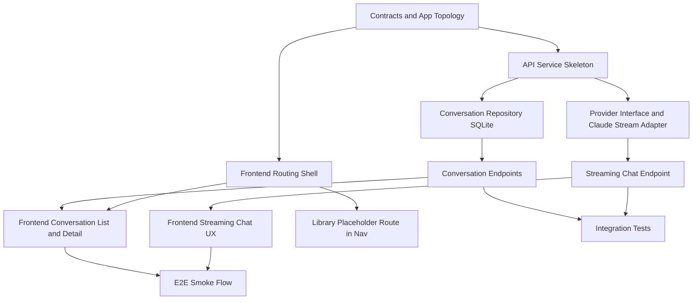
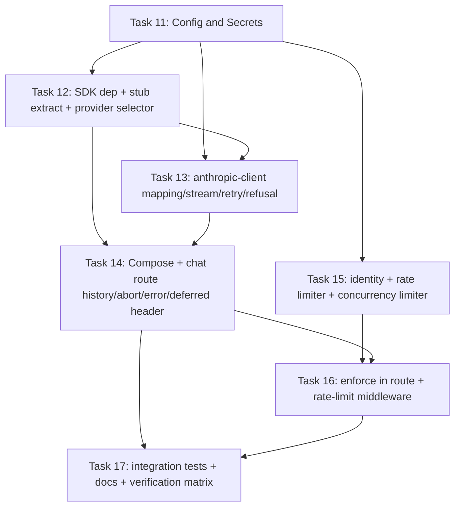

# Implementation Plan: NSR AI Chat Platform Foundation

## Overview
Build a local-first, production-oriented foundation from Design B mockup to a working chat product slice with streaming responses, persistent conversation history, and a visible Library placeholder route. This plan uses full manual-by-user implementation in the initial phase, with AI in guidance/review mode only.

## Read-Only Plan Mode
This document is planning-only. No implementation code is included in this step.

## Relevant Current Codebase State
1. Single Vite + React app in JavaScript at src-level.
2. Existing Design B mockup lives in flat root files and should be treated as visual reference material, not the final structure.
3. No backend API service, no shared contracts package, and no test runner scripts in root yet.
4. Existing tasks docs were for a different scraper project and are replaced by this plan.

## Dependency Graph

## Architecture Decisions for Implementation
1. Local runtime is primary; EC2-readiness comes from clean module boundaries, not premature cloud complexity.
2. Provider adapter contract is required before Claude implementation to prevent provider lock-in.
3. SQLite is local persistence only; relational migration path targets Postgres-like store later.
4. Library route is visible in main navigation from first usable build with explicit placeholder states.
5. Manual-ownership boundary: all foundation implementation tasks are user-implemented initially; AI is used for planning, reviews, and troubleshooting.
6. Frontend should be rebuilt into a feature-based shell from the start of implementation rather than evolving the flat mockup in place.

## Execution Policy (Manual-First)
1. User writes implementation code for all tasks in this plan during the initial phase.
2. AI provides design guidance, pseudocode, review comments, test strategy, and debugging support.
3. If user decides to delegate coding later, that change is explicit and scoped per task/module.

## Vertical Increments
1. Increment A: User sees a rebuilt Design B app shell with real navigation and Library placeholder.
2. Increment B: User can create/reopen persistent conversations through local API.
3. Increment C: User can send messages and receive streamed Claude responses.
4. Increment D: Foundation hardening, verification, and documentation for next-phase feature work.

## Phase Plan

### Phase 1: Foundations and Boundaries

#### Task 1: Establish workspace structure for frontend, API, retrieval stub, and shared contracts
Description: Create target folder topology, package boundaries, and baseline scripts so the foundation can grow without structural rewrites, including a proper feature-based frontend shell.

Acceptance criteria:
- [ ] New top-level package boundaries exist for API service, retrieval stub, and shared contracts.
- [ ] Root scripts orchestrate multi-service local dev and build commands.
- [ ] Existing frontend still runs after structure changes.
- [ ] Frontend target folders exist for app shell, features, shared components, lib utilities, and styles.

Verification:
- [ ] Manual check: expected directories exist and contain starter files.
- [ ] Command check: npm run dev executes frontend as before.
- [ ] Command check: npm run build completes for current frontend baseline.

Dependencies: None

Files likely touched:
- package.json
- src/app/
- src/components/
- src/features/
- src/lib/
- src/styles/
- services/api/
- services/retrieval/
- shared/contracts/
- docs/

Estimated scope: M

#### Task 2: Define API and domain contracts before endpoint implementation
Description: Create conversation, message, and streaming event contracts with versioned schema boundaries.

Acceptance criteria:
- [ ] Conversation and message DTOs are defined in shared contracts.
- [ ] Streaming event envelope format is defined and documented.
- [ ] Contract package can be consumed by frontend and API without circular dependencies.

Verification:
- [ ] Type check for contract package passes.
- [ ] Manual review: schema fields cover create/list/get/send-message workflows.

Dependencies: Task 1

Files likely touched:
- shared/contracts/
- docs/

Estimated scope: S

#### Task 3: Build routing shell with Design B preserved and Library nav item visible
Description: Rebuild the current mockup into a route-based app shell from the ground up while preserving Design B visual intent as the styling reference.

Acceptance criteria:
- [ ] Navigation includes Chat and Library entries.
- [ ] Library route is visible and renders placeholder/search-shell UI.
- [ ] Design B layout quality remains intact on desktop/mobile.
- [ ] New shell uses feature-based app composition rather than continuing the flat mockup structure.

Verification:
- [ ] Manual UI check in browser for Chat and Library routes.
- [ ] Frontend build passes.

Dependencies: Task 1

Files likely touched:
- src/app/
- src/components/
- src/features/chat/
- src/features/conversations/
- src/features/library/
- src/styles/
- src/main.jsx

Estimated scope: M

### Checkpoint A: After Phase 1
- [ ] Human review of structural boundaries before deep implementation.
- [ ] Confirm manual-first execution policy remains in force for all phase tasks.
- [ ] Confirm the new frontend shell structure is the intended foundation, not a temporary wrapper over the old mockup.
- [ ] Frontend remains stable while scaffolding expands.

### Phase 2: Persistent Conversation Foundation

#### Task 4: Create API service skeleton with health and conversation module wiring
Description: Stand up backend service frame and module registration without implementing business logic shortcuts.

Acceptance criteria:
- [ ] API process starts locally with environment-based configuration.
- [ ] Health endpoint and conversation route module registration work.
- [ ] Error handling and validation middleware are in place at baseline.

Verification:
- [ ] Manual check: API health endpoint responds.
- [ ] Lint/type checks pass for API package.

Dependencies: Tasks 1, 2

Files likely touched:
- services/api/src/
- services/api/package.json
- docs/

Estimated scope: M

#### Task 5: Implement SQLite-backed conversation repository and persistence migration hooks
Description: Add local persistence for conversations/messages with repository abstraction and migration path notes.

Acceptance criteria:
- [ ] Create/list/get conversation persistence works through repository interface.
- [ ] Message persistence is ordered and timestamped reliably.
- [ ] Persistence layer is abstracted for later Postgres swap.

Verification:
- [ ] Repository unit tests pass for CRUD operations.
- [ ] Integration test validates persistence across API restarts.

Dependencies: Task 4

Files likely touched:
- services/api/src/modules/conversations/
- services/api/src/persistence/
- services/api/tests/

Estimated scope: M

#### Task 6: Connect frontend conversations list and history detail to API
Description: Replace hardcoded sidebar items with API-backed conversation list and open-existing-thread behavior.

Acceptance criteria:
- [ ] User can create a new conversation from UI.
- [ ] Sidebar lists persisted conversations from backend.
- [ ] Selecting a conversation loads historical messages.

Verification:
- [ ] UI integration tests pass for create/list/open flow.
- [ ] Manual browser check confirms persisted history after reload.

Dependencies: Tasks 3, 5

Files likely touched:
- src/features/conversations/
- src/features/chat/
- src/app/AppShell.jsx
- tests/

Estimated scope: M

### Checkpoint B: After Phase 2
- [ ] End-to-end conversation persistence path works.
- [ ] Human review on API and persistence architecture before chat streaming implementation.

### Phase 3: Streaming Chat and Provider Adapter

#### Task 7: Define provider interface and implement Claude streaming adapter
Description: Introduce provider abstraction and Claude adapter that emits streaming chunks through unified events.

Acceptance criteria:
- [ ] Provider interface is independent of Claude-specific client details.
- [ ] Claude adapter emits normalized stream events.
- [ ] Adapter errors map to stable API error shape.

Verification:
- [ ] Contract tests validate adapter behavior against provider interface.
- [ ] Mock/provider tests validate stream event ordering.

Dependencies: Tasks 2, 4

Files likely touched:
- services/api/src/modules/providers/
- shared/contracts/
- services/api/tests/

Estimated scope: M

#### Task 8: Implement streaming chat endpoint and frontend streaming renderer
Description: Wire send-message flow from UI to backend streaming endpoint and render incremental assistant response.

Acceptance criteria:
- [ ] User message is persisted before stream begins.
- [ ] Assistant response appears incrementally while streaming.
- [ ] Final assistant message is persisted and available on conversation reopen.

Verification:
- [ ] Integration tests validate streaming endpoint lifecycle.
- [ ] Manual check confirms incremental UI updates and reload persistence.

Dependencies: Tasks 6, 7

Files likely touched:
- services/api/src/modules/chat/
- src/features/chat/
- src/features/conversations/
- tests/

Estimated scope: M

### Checkpoint C: After Phase 3
- [ ] Full core acceptance path works: create conversation -> stream response -> reopen history.
- [ ] Human review of architecture-critical implementation before hardening.

### Phase 4: Hardening, Testing, and Launch Readiness for Local Phase

#### Task 9: Add auth/search extension seams and explicit not-implemented behaviors
Description: Add stubs/interfaces for magic-link auth and file search/filter API contracts without full feature implementation.

Acceptance criteria:
- [ ] Auth extension interfaces exist with clear TODO boundaries.
- [ ] Library placeholder clearly communicates deferred capability.
- [ ] Search/filter contracts exist without fake production logic.

Verification:
- [ ] Manual route/API check confirms stable placeholder behavior.
- [ ] Lint/type checks pass after extension seam additions.

Dependencies: Tasks 3, 4, 8

Files likely touched:
- services/api/src/modules/auth/
- services/api/src/modules/library/
- src/features/library/
- shared/contracts/

Estimated scope: S

#### Task 10: Test matrix, developer docs, and operational checklist
Description: Add tests and docs that map directly to spec acceptance criteria and local operational workflow.

Acceptance criteria:
- [ ] Every spec acceptance criterion has test or explicit manual verification mapping.
- [ ] Root commands for dev/test/build are documented and runnable.
- [ ] Manual architecture ownership workflow is documented for future sessions.

Verification:
- [ ] npm test passes.
- [ ] npm run lint passes.
- [ ] npm run build passes.
- [ ] Manual docs review confirms clear next steps for implementation phase.

Dependencies: All prior tasks

Files likely touched:
- README.md
- docs/
- tests/
- package.json

Estimated scope: M

### Checkpoint D: Ready to Implement at Scale
- [ ] All local foundation acceptance criteria verified.
- [ ] Human signs off before login/search/ingestion implementation phase.
- [ ] Risks and deferred hardening items are logged.

## Parallelization Opportunities
1. Task 3 (frontend routing shell) and Task 4 (API skeleton) can run in parallel after Task 1.
2. Contract work in Task 2 can start as soon as Task 1 is done and should be completed before deep API/UI wiring.
3. Task 9 documentation/stub framing can be started late in Phase 3 while final tests are being stabilized.

## Risks and Mitigations

| Risk | Impact | Mitigation |
|---|---|---|
| API and frontend diverge on stream event format | High | Lock contracts in Task 2 and add contract tests in Task 7 |
| Design B quality regresses during routing/state refactor | Medium | Preserve style baselines and add manual UI checkpoint in Phase 1 |
| Local persistence choices block production migration | Medium | Enforce repository abstraction and migration seams in Task 5 |
| User familiarity goals degrade if AI starts writing production code too early | High | Enforce manual-first execution policy and explicit opt-in for any delegated coding |

## Manual-Ownership Checkpoints
1. After Task 2: user confirms manual implementation ownership for upcoming API internals.
2. After Task 5: user confirms persistence code was manually implemented and reviewed.
3. After Task 8: user confirms provider and streaming implementation was manually implemented and reviewed.

## Open Questions
1. None at planning time.

---

# Implementation Plan: Phase 2 — Claude API Live Integration

## Overview
Replace the in-process stub chat client with the real Claude API behind the
existing provider/normalization seam, while preserving every current contract
(NDJSON stream envelope, persistence, route shapes). Adds multi-user safety
(rate limiting + per-user concurrency caps), upstream resilience (bounded
retry/backoff), and disconnect-driven abort. File ingestion/retrieval stays out
of scope. Source of truth: SPEC.md "Spec Addendum: Phase 2 — Claude API Live
Integration".

## Read-Only Plan Mode
This document is planning-only. No implementation code is included in this step.

## Execution Policy (Phase 2)
1. Manual ownership is preserved. The codebase owner types in every change by
   hand for full familiarity.
2. AI authors the changes as small, file-by-file, typeable blocks with
   explanations; the owner types and owns them. This is an explicit, scoped
   opt-in to AI-authored code for this phase only (per base-spec Ask-First item).
3. No file is edited or added by AI in the implementation phase except planning
   and spec documents.

## Relevant Current Codebase State
1. `claude-provider.mjs` is a pure normalization layer (raw client events ->
   `start`/`delta`/`done` envelope); it is unit-tested and stays unchanged.
2. `modules/chat/routes.mjs` currently builds an inline stub client and passes
   only the latest user message to the provider.
3. `persistence/conversation-repository.mjs` exposes
   `listMessagesByConversationId` returning ordered `{role, content}` — exactly
   the shape Claude needs; no schema change required.
4. `tests/integration/chat-stream-lifecycle.spec.mjs` calls
   `createServer({ startedAt, dbPath })` with no Claude config and asserts the
   stream contract — so the stub must remain the default when no API key is set.
5. `services/api` currently has zero runtime dependencies.

## Dependency Graph

## Architecture Decisions for Implementation
1. Provider remains transport-agnostic; the real client is selected only when
   `ANTHROPIC_API_KEY` is present, else the stub (keeps tests and key-less dev
   green, prevents accidental spend, no startup crash).
2. Composition root (`create-server.mjs`) builds the provider and limiters and
   injects them; routes never construct dependencies directly.
3. Retry/backoff is owned in the client (SDK `maxRetries: 0`) and applies only
   before the first streamed token; mid-stream failures become an `error`
   envelope.
4. The 200 NDJSON header is written lazily on the first stream event so
   pre-stream failures can return a real HTTP status.
5. Limiters are in-memory behind a swappable store interface; multi-instance EC2
   (Redis) is a documented extension point.
6. Identity for limits resolves auth-user -> trusted `X-User-Id` -> client IP;
   proxy headers are trusted only behind an explicit flag.

## Vertical Increments
1. Increment E: Configuration and secret handling load safely (key absent is a
   valid, safe state).
2. Increment F: A real, context-aware Claude response streams and persists end
   to end; stub fallback intact; disconnect aborts upstream.
3. Increment G: Per-user rate limit and concurrency cap return 429s before any
   upstream call; slots release on completion/error/disconnect.
4. Increment H: Phase-2 acceptance criteria verified by tests and docs.

## Phase Plan

### Phase 5: Configuration and Secrets

#### Task 11: Add Claude + limiter configuration and secret handling
Description: Extend env config with all Claude/limiter/retry/identity settings;
add `.env.example` and ensure `.env` is git-ignored. No secret defaults.

Acceptance criteria:
- [ ] `env.mjs` exposes `anthropicApiKey`, `claudeModel` (default
      `claude-opus-4-8`), `claudeMaxTokens`, `claudeSystemPrompt`,
      `claudeThinking` (default off), `claudeMaxConcurrentPerUser`,
      `claudeRateLimitMax`, `claudeRateLimitWindowMs`, `claudeRetryMaxAttempts`,
      `claudeRetryBaseMs`, `trustProxyHeader`.
- [ ] `anthropicApiKey` defaults to undefined; no real secret in any default.
- [ ] `services/api/.env.example` documents every variable.
- [ ] `services/api/.env` (and `**/.env`) is git-ignored.

Verification:
- [ ] `npm test` still passes (config change is non-breaking; stub path intact).
- [ ] Manual: `git status` shows `.env` is ignored; `.env.example` is tracked.

Dependencies: None
Files likely touched: services/api/src/config/env.mjs,
services/api/.env.example, .gitignore
Estimated scope: S

### Checkpoint E: After Phase 5
- [ ] Human review of config surface and secret handling before any live call.
- [ ] Confirm key-absent is treated as a safe default, not an error.

### Phase 6: Real Claude Streaming (core vertical)

#### Task 12: Add SDK dependency, extract stub client, add provider selector
Description: Add `@anthropic-ai/sdk` to the API package; move the inline stub to
its own module; add `create-chat-provider.mjs` that selects real vs stub by key
presence and wraps in the existing `createClaudeProvider`.

Acceptance criteria:
- [ ] `@anthropic-ai/sdk` is in `services/api` dependencies and installed.
- [ ] Stub client lives in `providers/stub-claude-client.mjs` (behavior identical).
- [ ] `create-chat-provider.mjs` returns the stub provider when no key, and is
      structured to return the real provider when a key is present.

Verification:
- [ ] Unit test: selector returns stub client when `apiKey` is undefined.
- [ ] `npm test` passes (stub path unchanged).

Dependencies: Task 11
Files likely touched: services/api/package.json,
services/api/src/modules/providers/stub-claude-client.mjs,
services/api/src/modules/providers/create-chat-provider.mjs,
services/api/tests/unit/
Estimated scope: S

#### Task 13a: Anthropic client core — mapping, streaming, event translation
Description: `createAnthropicClient({...})` maps repo messages -> Anthropic
`{role, content}`, sends the configured system prompt via `system`, streams via
the SDK with `maxRetries: 0`, maps SDK stream events to internal events
(`message_start`/`content_delta`/`message_done`), and throws typed errors on
refusal / non-retryable failure. No retry logic yet (single attempt).

Acceptance criteria:
- [ ] Repo messages map correctly to Anthropic message format; system prompt is
      sent via `system`, not as a message.
- [ ] SDK text deltas map to `content_delta`; non-text blocks (thinking) are not
      surfaced.
- [ ] Refusal stop reason and non-retryable errors are thrown (not swallowed).
- [ ] SDK is configured with `maxRetries: 0` (retry owned later in 13b).

Verification:
- [ ] Unit tests with an injected fake SDK: mapping, event translation,
      refusal->throw.
- [ ] `npm test` passes.

Dependencies: Tasks 11, 12
Files likely touched:
services/api/src/modules/providers/anthropic-client.mjs,
services/api/tests/unit/
Estimated scope: S

#### Task 13b: Anthropic client resilience — retry/backoff and abort
Description: Add bounded pre-stream exponential backoff on retryable errors
(429/5xx/overload, honoring `Retry-After`) up to the configured max, and honor an
AbortSignal. Retry applies only before the first streamed token.

Acceptance criteria:
- [ ] Retryable errors before the first token retry with exponential backoff up
      to `claudeRetryMaxAttempts`, starting from `claudeRetryBaseMs`.
- [ ] No retry occurs once streaming has started (first token emitted).
- [ ] An aborted signal stops iteration/retries promptly.

Verification:
- [ ] Unit tests with an injected fake SDK: retry-then-success,
      no-retry-after-first-token, abort.
- [ ] `npm test` passes.

Dependencies: Task 13a
Files likely touched:
services/api/src/modules/providers/anthropic-client.mjs,
services/api/tests/unit/
Estimated scope: S

#### Task 14: Compose provider into server and upgrade the chat route
Description: Build the provider in `create-server.mjs` from config and inject it
into `createChatRoutes`. Update the route to load full thread history, defer the
200 header until the first event, wire abort on client disconnect, persist
partial/whole assistant text appropriately, and map thrown errors to an `error`
envelope (or a real HTTP status if pre-stream).

Acceptance criteria:
- [ ] With a valid key, sending a message returns a real, context-aware streamed
      response, persisted as before.
- [ ] Full conversation history is sent to Claude.
- [ ] Pre-stream failure -> proper HTTP error; mid-stream failure -> `error`
      envelope; neither crashes the server.
- [ ] Client disconnect aborts the upstream call.
- [ ] With no key, the stub path still serves and persists.

Verification:
- [ ] `npm test` passes (existing stub integration test unchanged).
- [ ] Manual smoke with a live key: real streamed answer; reload shows history.
- [ ] Manual: disconnect mid-stream and confirm upstream abort (log/observation).

Dependencies: Tasks 12, 13
Files likely touched: services/api/src/server/create-server.mjs,
services/api/src/modules/chat/routes.mjs
Estimated scope: M

### Checkpoint F: After Phase 6
- [ ] Core acceptance path verified against real Claude: create -> stream ->
      reopen history.
- [ ] Stub fallback confirmed intact (tests green with no key).
- [ ] Human review before adding limiter enforcement.

### Phase 7: Multi-User Safety

#### Task 15: Identity resolution, rate limiter, concurrency limiter
Description: Add `resolve-user-key.mjs` (auth -> trusted `X-User-Id` -> IP, with
explicit proxy-trust flag), `rate-limiter.mjs` (fixed-window/token-bucket with a
swappable store interface), and `concurrency-limiter.mjs` (per-identity in-flight
counter with acquire/release).

Acceptance criteria:
- [ ] Identity resolves correctly across auth/header/IP, ignoring proxy headers
      unless the trust flag is set.
- [ ] Rate limiter allows under the limit, blocks over, resets after the window.
- [ ] Concurrency limiter acquires/releases, rejects over cap, releases on error.
- [ ] Both expose a minimal interface so the store can be swapped.

Verification:
- [ ] Unit tests for identity resolution, rate limiter, and concurrency limiter.
- [ ] `npm test` passes.

Dependencies: Task 11
Files likely touched: services/api/src/lib/resolve-user-key.mjs,
services/api/src/lib/rate-limiter.mjs,
services/api/src/lib/concurrency-limiter.mjs, services/api/tests/unit/
Estimated scope: M

#### Task 16: Enforce limits in the chat route + rate-limit middleware
Description: Add `middleware/rate-limit.mjs`; wire identity, rate limit, and
concurrency cap into the chat stream route before any upstream call; release the
concurrency slot in `finally` (covers completion, error, and disconnect).

Acceptance criteria:
- [ ] Over-cap requests return 429 with no upstream call.
- [ ] Over-rate-limit requests return 429 with `Retry-After`.
- [ ] Concurrency slot is always released (success/error/disconnect).
- [ ] Limits key on the resolved identity.

Verification:
- [ ] Integration tests: 429 on exceeded cap and exceeded rate limit.
- [ ] Manual: rapid requests trigger 429; slots free up afterward.
- [ ] `npm test` passes.

Dependencies: Tasks 14, 15
Files likely touched: services/api/src/middleware/rate-limit.mjs,
services/api/src/modules/chat/routes.mjs,
services/api/src/server/create-server.mjs, services/api/tests/integration/
Estimated scope: M

### Checkpoint G: After Phase 7
- [ ] Rate limit + concurrency cap verified end to end.
- [ ] Human review of limiter design and the in-memory/per-instance caveat
      (Redis as the multi-instance extension point).

### Phase 8: Verification and Docs

#### Task 17: Integration tests, docs, and verification matrix
Description: Add the remaining integration tests (error envelope on thrown
client error; 429 cases), document env/setup in README and DEVELOPER docs, and
map every Phase-2 acceptance criterion in the verification matrix.

Acceptance criteria:
- [ ] Every Phase-2 spec acceptance criterion maps to a test or explicit manual
      check.
- [ ] README/docs document `.env` setup, the SDK install step, and limiter env.
- [ ] Verification matrix updated for Phase 2.

Verification:
- [ ] `npm test`, `npm run lint`, `npm run build` pass.
- [ ] Manual docs review: a new dev can configure a key and run live chat.

Dependencies: Tasks 14, 16
Files likely touched: README.md, docs/VERIFICATION_MATRIX.md, docs/DEVELOPER.md,
services/api/tests/integration/
Estimated scope: M

### Checkpoint H: Phase 2 Complete
- [ ] All Phase-2 acceptance criteria verified.
- [ ] Human sign-off.
- [ ] Deferred items logged (multi-instance shared store, surfacing thinking,
      auth-based identity once magic-link lands).

## Parallelization Opportunities
1. Task 15 (limiter/identity libs) depends only on Task 11 and can be built in
   parallel with the Task 12 -> 14 core path.
2. `.env.example` and `.gitignore` work in Task 11 is independent of code.

## Risks and Mitigations

| Risk | Impact | Mitigation |
|---|---|---|
| Double retries (SDK + ours) | Medium | Set SDK `maxRetries: 0`; own retry in the client |
| Mid-stream failure cannot be retried cleanly | Medium | Retry only pre-first-token; mid-stream -> `error` envelope; documented |
| In-memory limiters not global on multi-instance EC2 | Medium | Swappable store interface; Redis as documented extension point |
| Identity spoofing via `X-Forwarded-For` | High | Trust proxy headers only behind explicit flag; default to socket IP |
| Header already sent when error occurs | Medium | Defer 200 NDJSON header until first event |
| Tests/CI break without an API key | High | Stub fallback is the default when key absent; never remove it |
| Concurrency slot leak on disconnect | Medium | Release slot in `finally` |
| Abandoned streams burn tokens | Medium | Abort upstream on client disconnect |

## Manual-Ownership Checkpoints
1. After Task 11: owner confirms config/secret handling typed and understood.
2. After Task 14: owner confirms client + route changes typed and reviewed.
3. After Task 16: owner confirms limiter enforcement typed and reviewed.

## Open Questions
1. None at planning time.
